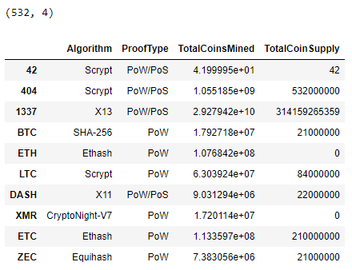
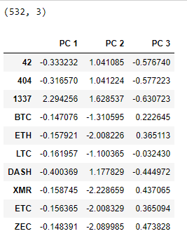
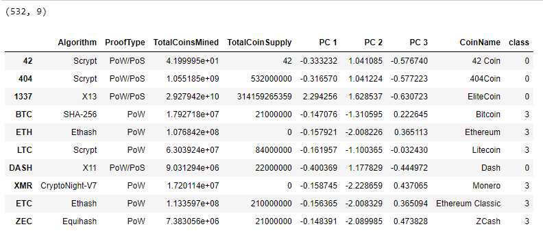
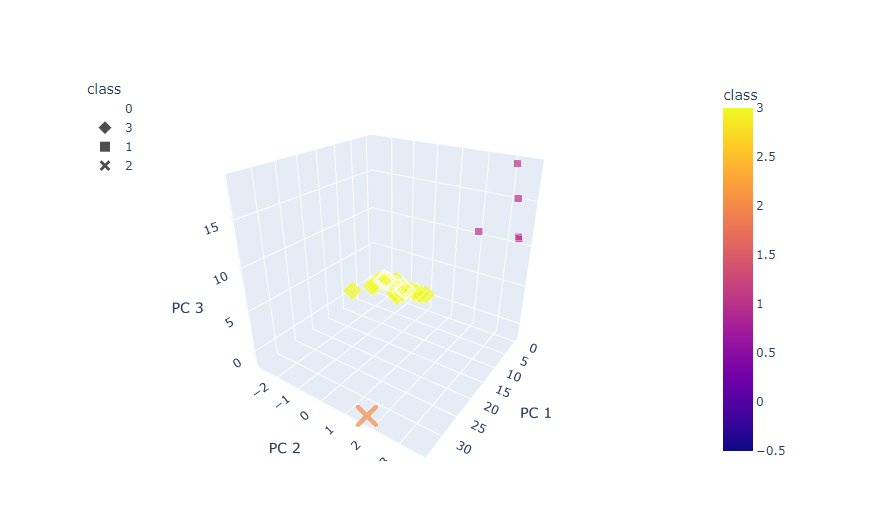
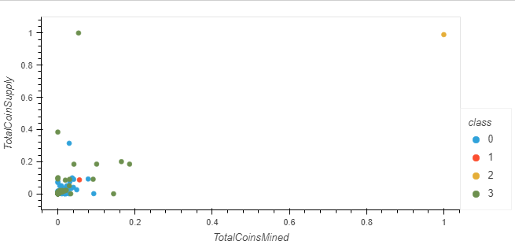

# Cryptocurrencies

## Overview of the analysis

The purpose of this project is to create a report that includes what cryptocurrencies are on the trading market and how they could be grouped to create a classification system for this new investment.

## Results

This new assignment consists of four technical analysis deliverables as follows:

**I** Preprocessing the Data for PCA

**II** Reducing Data Dimensions Using PCA

**III** Clustering Cryptocurrencies Using K-means

**IV** Visualizing Cryptocurrencies Results

